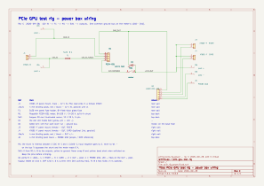

# PCIe test rig — wiring guide

The power box for a bench PCIe GPU test rig: a fused, switched, metered 12 V feed with keyed XT60 outputs for the riser and the card, banana pairs on both ends for probing and for a bench supply with plain leads, and a ground post for your scope or DMM. This is the electrical reference: the wire-by-wire list and the reasons behind it. The procedure is [BUILD.md](BUILD.md), the shopping list is [BOM.md](BOM.md). The schematic it follows is [`wiring/pcie_rig_power.kicad_sch`](wiring/pcie_rig_power.kicad_sch) — open it in KiCad, or read the [PDF](wiring/pcie_rig_power.pdf) / [SVG](wiring/pcie_rig_power.svg). Rev D.

Panel positions, the "cup", and the storage bin refer to the printed enclosure, which lives in the models repo as `pcie-rig-enclosure` ([in review](https://github.com/IamMrCupp/3d-printer-models/pull/165)). The wiring doesn't depend on it — any box that takes a 20 mm rocker, a 5×20 panel fuse holder, 4 mm posts, XT60E panel connectors, and the PZEM-031's 84 × 44 mm cutout will do.

**What it is, and isn't.** The source is an OWON bench supply set to **12.0 V, OVP ~12.6 V, current limit 6 A** — the rig's working ceiling, and plenty for watching a card come up without letting a short cook anything. It never carries full boot current. An **8 A** fast-blow fuse on the rear panel is the backstop; the kit goes 5 → 8 A, and 5 would blow in normal use. Everything else in the path is overrated on purpose: 20 A switch, 30 A connectors, 14 AWG wire. This is a diagnostic rig, not a load tester.

## References

What each designator on the sheet is. Quantities, sources and dimensions are in [BOM.md](BOM.md).

| Ref | Part | Where |
|---|---|---|
| **J1** | XT60E-M panel mount, male — 12 V IN. The supply lead ends in a female XT60H | rear wall |
| **J2, J7** | 4 mm binding posts, red / black — 12 V IN, in parallel with J1 | rear wall |
| **W3, W4** | WAGO 221-413 three-port — join the XT60 pigtail and the post on + and on − | inside |
| **F1** | 5×20 mm panel fuse holder, 8 A fast-blow | rear wall |
| **M1** | Peacefair PZEM-031 meter, built-in shunt | top deck |
| **SW1** | Ampper 20 mm illuminated rocker, 3-pin | top deck |
| **D1** | the dot LED inside SW1 — yellow pin is its return | — |
| **W2** | WAGO 221-415 five-port — the switched + bus | inside |
| **W1** | WAGO 221-415 five-port — the ground bus | inside, on the base floor |
| **J3, J4** | XT60E-F panel mount, female — OUT **RISER**, OUT **CARD** (J4 optional, parallel) | right wall |
| **J5, J8** | 4 mm binding posts, red / black — OUT +/− | right wall |
| **J6** | 4 mm binding post, black — PROBE GND | top deck |

## Where things go

| Face | Carries |
|---|---|
| **Top deck** | M1, SW1, J6, and the storage bin |
| **Rear** | J1, J2, J7, F1 — swap a fuse without opening the box |
| **Right** | J3, J4, J5, J8 |
| **Inside** | W1 on the base floor; W2, W3, W4 on their wires |

The top is fixed — service is four screws on the sides and the cup lifts off its base with all its wiring intact. Nothing that carries current is on a part you remove to get at something else.

## Signal path

**12 V IN → F1 → M1 → SW1 → outputs.** The meter sits *ahead* of the switch, so it reads the supply whenever the supply is on; the switch only gates the outputs. That's deliberate: you see 12.0 V on the box before you ever enable the card.

## Wire by wire

Net names match the schematic. All 14 AWG unless noted. Every join is a WAGO 221: nothing in the box is soldered, and no terminal ever takes two wires.

| # | From | To | Net | Notes |
|---|---|---|---|---|
| 1 | J1 **+** pigtail | W3 | `12V_IN` | 12 AWG as supplied |
| 2 | J2 (red post) | W3 | `12V_IN` | |
| 3 | W3 | F1, either end | `12V_IN` | the one wire into the fuse |
| 4 | F1, other end | M1 terminal **3** — DC IN + | `12V_IN_FUSED` | ferrule |
| 5 | J1 **−** pigtail | W4 | `GND_IN` | |
| 6 | J7 (black post) | W4 | `GND_IN` | |
| 7 | W4 | M1 terminal **2** — DC IN − | `GND_IN` | **Not W1** — see below |
| 8 | M1 terminal **4** — LOAD + | SW1 **A** (power) | `12V_METERED` | spade |
| 9 | SW1 **B** (load) | W2 | `+12V_OUT` | spade on the tab, lever nut on the other end |
| 10 | W2 | J3 **+** pigtail | `+12V_OUT` | RISER |
| 11 | W2 | J4 **+** pigtail | `+12V_OUT` | CARD |
| 12 | W2 | J5 (red post) | `+12V_OUT` | the fifth port stays spare |
| 13 | M1 terminal **1** — LOAD − | W1 | `GND_OUT` | the ground bus starts here |
| 14 | W1 | J3 **−** pigtail | `GND_OUT` | RISER |
| 15 | W1 | J4 **−** pigtail | `GND_OUT` | CARD |
| 16 | W1 | J8 (black post) | `GND_OUT` | |
| 17 | W1 | J6 (probe post) | `GND_OUT` | |
| 18 | SW1 **yellow** (LED −) | J8's terminal | `GND_OUT` | 18 AWG is fine; it shares the OUT − post's ring terminal |

**PZEM-031 terminals**, top to bottom as printed on its back: **1 LOAD −, 2 DC IN −, 3 DC IN +, 4 LOAD +.** The + side passes straight through 3 → 4; the shunt sits between 2 and 1.

**Why the input negative gets its own lever nut and never touches W1.** The meter measures current as the drop across its internal shunt, which is in the negative leg between terminals 2 and 1. Land the input negative on the ground bus and the current bypasses the shunt: the meter reads 0.00 A forever and the rig looks dead when it isn't. Input − goes through W4 to terminal 2, the bus hangs off terminal 1, and the probe post — J6 — is on that bus, so a scope reference sees exactly what the card sees.

**Why the rocker's B and yellow must never swap.** A = supply, B = load, yellow = LED return to ground. Put the load wire on yellow and ground on B and the first flick of the switch is a dead short across the meter. Beep the three pins in continuity mode before you crimp: A–B closes when the rocker is on, yellow never closes to either.

## Leads (you build these; they live in a parts drawer)

All from the six-pack of 6+2 dual-output PCIe cords. Cut the PSU-side 8-pin off each and put a **male XT60H** (AMASS, with the sheath housing) on the cut end: yellows to +, blacks to −.

- **Dual lead.** One cord → XT60H → 2 × 8(6+2). Feeds the riser's 6-pin (leave the +2 tail off) and one card connector, or two card connectors.
- **Quad lead.** Two cords → 4 × 8-pin, for the 4×8-pin → 12VHPWR adapter. Twelve 18 AWG wires won't go in one XT60 solder cup — splice them to a short **12 AWG XT60 pigtail** instead, heat-shrunk.
- **Riser lead.** The riser kit's own SATA → 6-pin cord. Cut the SATA plug off — it's the weak point on these adapters, about 4.5 A across its three 12 V pins — and solder a male XT60H to the cut end. Mine has 2 yellow and 4 black: twist and tin each group, yellows into +, all four blacks into − (one black is the 6-pin's sense line, tied to ground). Four 18 AWG blacks are about the size of the cup; if they won't seat, butt-splice them to a short 14 AWG tail first. Any red or orange wire is 5 V / 3.3 V from the SATA side: cut it back and insulate it. Sheath on the wire before you solder.

Beep every lead end-to-end before it touches a card: + to every yellow pin, − to every black, nothing between.

## Building it

The procedure — fitting, wiring order, the continuity table and the first power-up — is [BUILD.md](BUILD.md).

## Limits

- **6 A working limit**, set at the supply. Fuse at 8 A fast-blow. Never above the meter's 20 A.
- The meter needs ≥ 8 V to run. Below that it goes dark; the rig still passes power.
- Everything downstream of an XT60 runs on the lead's 18 AWG yellows. Fine at 6 A. Fine at 20. Not at 30.
- If the rig is ever fed from something other than the OWON, add a reverse-polarity module on the input first. XT60 is keyed; banana posts are not.

## Files

- [`wiring/pcie_rig_power.kicad_sch`](wiring/pcie_rig_power.kicad_sch) — KiCad 10 schematic, the source. ERC clean with every severity on.
- [`wiring/pcie_rig_power.pdf`](wiring/pcie_rig_power.pdf), [`wiring/pcie_rig_power.svg`](wiring/pcie_rig_power.svg) — renders. Regenerate with `kicad-cli sch export pdf` / `svg`.
- [`wiring/pcie_rig_power_bom.csv`](wiring/pcie_rig_power_bom.csv) — the parts list KiCad extracts from the schematic, grouped by value. Regenerate with `kicad-cli sch export bom`; CI checks it matches.
